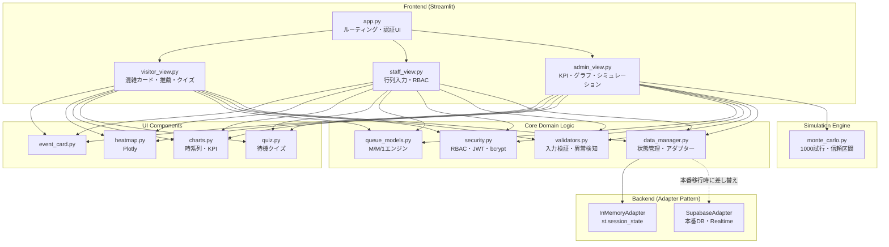

# 🎪 FestivalFlow AI

> **Real-time crowd management system for Japanese school cultural festivals**  
> M/M/1 Queueing Theory × Zero-Trust Security × Clean Architecture

[](https://python.org)
[](https://streamlit.io)
[](LICENSE)
[](tests/)

---

## 🎯 Overview / 概要

**English:**  
FestivalFlow AI is a production-grade crowd management system that applies **M/M/1 queueing theory** — the same mathematical model used by Disney, airports, and hospitals — to school cultural festivals. Visitors can check real-time congestion, staff input queue data, and administrators monitor the entire event through a comprehensive analytics dashboard.

**日本語:**  
FestivalFlow AI は、Disney・空港・病院で使われる **M/M/1待ち行列理論** を文化祭に応用した、本番品質の混雑管理システムです。来場者はリアルタイムで混雑状況を確認でき、担当者は行列データを入力し、管理者は包括的なダッシュボードでイベント全体を監視できます。

---

## 🏗️ System Architecture / システムアーキテクチャ



---

## 📐 Mathematical Model / 数理モデル

### M/M/1 Queueing Theory (Kleinrock, 1975)

The system applies the **M/M/1 queue model** with the following assumptions:
- Customer arrivals follow a **Poisson process** (independent, random arrivals)
- Service times follow an **Exponential distribution**
- Single server with FCFS discipline

$$\lambda = \frac{N_{queue}}{T_{window}} \quad \text{[arrival rate, people/min]}$$

$$\mu = \frac{c}{S_{avg}} \quad \text{[service rate, people/min]}$$

$$\rho = \frac{\lambda}{\mu} \quad \text{[server utilization, 0 ≤ ρ < 1 for stability]}$$

**When ρ < 1 (stable state):**

$$L_q = \frac{\rho^2}{1-\rho} \quad \text{[mean queue length]}$$

$$W_q = \frac{\rho}{\mu(1-\rho)} \quad \text{[mean waiting time]}$$

**Congestion thresholds:**

| ρ value | Status | Color |
|---------|--------|-------|
| ρ < 0.5 | 🟢 LOW | Green |
| 0.5 ≤ ρ < 0.75 | 🟡 MODERATE | Yellow |
| 0.75 ≤ ρ < 0.9 | 🟠 HIGH | Orange |
| 0.9 ≤ ρ < 1.0 | 🔴 CRITICAL | Red |
| ρ ≥ 1.0 | 🚫 SATURATED | Purple |

---

## 🔐 Security Design / セキュリティ設計

**Zero-Trust Security Model implementation:**

| Threat | Countermeasure | Implementation |
|--------|---------------|----------------|
| Privilege escalation | RBAC + Least Privilege | `ROLES` dict with explicit permission lists |
| Plain-text password leak | bcrypt (cost=12) | `bcrypt.hashpw` / `bcrypt.checkpw` |
| Session fixation | session_id regeneration | `uuid.uuid4()` on every role elevation |
| Replay attack | JWT expiration | `exp` claim = 8 hours |
| XSS injection | Input sanitization | `sanitize_text_input()` in validators.py |
| DoS via large input | Range validation | Queue length capped at 500 |

---

## 👥 Role-Based Access Control / ロール構成

```
VISITOR (level 0)
└── read:events, read:wait_time
    └── Accessible: visitor_view

STAFF (level 1)
└── + write:queue
    └── Accessible: visitor_view, staff_view
    └── PIN: 1234 (demo)

ADMIN (level 2)
└── + read:analytics, write:config, export:data
    └── Accessible: all views + simulation
    └── PIN: 9999 (demo)
```

---

## 🚀 Quick Start / クイックスタート

### Streamlit Cloud Deployment

1. Fork this repository
2. Go to [share.streamlit.io](https://share.streamlit.io)
3. Connect your GitHub repo
4. Set `app.py` as the main file
5. Add secrets in Streamlit Cloud dashboard:
   ```toml
   JWT_SECRET_KEY = "your-32-char-secret-key"
   ```

### Local Development / ローカル開発

```bash
# 1. リポジトリをクローン
git clone https://github.com/your-username/festivalflow-ai.git
cd festivalflow-ai

# 2. 仮想環境の作成・有効化
python -m venv venv
source venv/bin/activate  # macOS/Linux
# venv\Scripts\activate   # Windows

# 3. 依存パッケージのインストール
pip install -r requirements.txt

# 4. 環境変数の設定
cp .env.example .env
# .env を編集してシークレットキーを設定

# 5. アプリの起動
streamlit run app.py

# 6. テストの実行
pytest tests/ -v --cov=core --cov-report=term-missing
```

---

## 📁 Directory Structure / ディレクトリ構造

```
festivalflow-ai/
├── app.py                    # Streamlit エントリーポイント
├── requirements.txt          # 依存ライブラリ（バージョン固定）
├── .env.example              # 環境変数テンプレート
│
├── core/                     # ドメインロジック層
│   ├── queue_models.py       # M/M/1待ち行列エンジン
│   ├── security.py           # 認証・RBAC・JWT
│   ├── validators.py         # 入力バリデーション・異常検知
│   └── data_manager.py       # 状態管理・アダプター層
│
├── views/                    # Streamlit画面層
│   ├── visitor_view.py       # 来場者：混雑カード・推薦・クイズ
│   ├── staff_view.py         # 担当者：行列入力UI
│   └── admin_view.py         # 管理者：KPI・グラフ・シミュレーション
│
├── components/               # 再利用可能UIコンポーネント
│   ├── event_card.py         # イベントカード
│   ├── heatmap.py            # フロアマップ（Plotly）
│   ├── charts.py             # 時系列・KPIグラフ
│   └── quiz.py               # 待機クイズ
│
├── simulation/               # シミュレーションエンジン
│   └── monte_carlo.py        # モンテカルロ法（1000試行）
│
└── tests/                    # 自動テストスイート
    ├── test_queue_models.py  # M/M/1数式の単体テスト
    ├── test_validators.py    # バリデーションテスト
    └── test_security.py      # 認証・RBACテスト
```

---

## 🎮 Features by Role / ロール別機能

### 🙋 来場者（VISITOR）— 認証不要
- **混雑度カード** — 全10イベントをカード形式で表示（緑/黄/赤）
- **AI穴場推薦** — ρ値が低いTOP3を「今すぐ行くべき！」バナーで表示
- **ソート機能** — 待ち時間順・カテゴリ別・おすすめ順
- **トレンド矢印** — 直近5件の履歴から↑↓→を自動算出
- **待機クイズ** — 15分以上待ちで大谷翔平×K-POPクイズを表示

### 📋 担当者（STAFF）— PIN: 1234
- **行列入力UI** — ±1ボタン・直接入力フォーム
- **リアルタイムバリデーション** — 型・範囲・急激変化を即時チェック
- **フィードバック表示** — 成功トースト・警告・異常値アラート

### 🔐 管理者（ADMIN）— PIN: 9999
- **KPIカード×4** — 総来場推定人数・平均ρ・最混雑イベント・異常値件数
- **時系列グラフ** — Plotlyインタラクティブグラフ（フィルター・ズーム）
- **フロアマップヒートマップ** — 3×4グリッド、マウスオーバー詳細表示
- **ランキングテーブル** — 混雑TOP5 & 空きBOTTOM5
- **モンテカルロシミュレーション** — 1000試行・95%信頼区間・感度分析
- **CSVエクスポート** — 全履歴データのダウンロード（UTF-8 BOM）
- **デモモード** — 5秒間隔のランダム変動シミュレーション

---

## 🧪 Test Coverage / テストカバレッジ

```bash
pytest tests/ -v --cov=core --cov-report=term-missing
```

| Module | Tests | Coverage Goal |
|--------|-------|---------------|
| queue_models.py | 18 tests | ≥ 90% |
| validators.py | 22 tests | ≥ 85% |
| security.py | 20 tests | ≥ 85% |

---

## 🗺️ Roadmap / 今後の改善計画

| Phase | Timeline | Feature |
|-------|----------|---------|
| Phase 1 | 3ヶ月 | LSTM時系列予測（30分後の混雑を予測） |
| Phase 2 | 6ヶ月 | M/G/1モデルへの拡張（一般分布サービス時間） |
| Phase 3 | 1年 | 強化学習による動的スタッフ配置最適化 |
| Phase 4 | 1年+ | Supabase Realtime によるリアルタイム同期 |

---

## 📚 References / 参考文献

1. Kleinrock, L. (1975). *Queueing Systems Vol.1*. Wiley.
2. Little, J.D.C. (1961). A proof for the queueing formula: L = λW. *Operations Research, 9(3)*, 383–387.
3. Ross, S.M. (2006). *Simulation* (4th ed.). Academic Press.
4. NIST Zero Trust Architecture (SP 800-207), 2020.

---

## 👤 Author / 作者

Developed as a portfolio project demonstrating the intersection of:
- **Operations Research** (M/M/1 queueing theory)
- **Enterprise Security** (Zero-Trust, RBAC, bcrypt, JWT)
- **Software Engineering** (Clean Architecture, Adapter Pattern, TDD)

---

## 📄 License

MIT License — see [LICENSE](LICENSE) for details.
